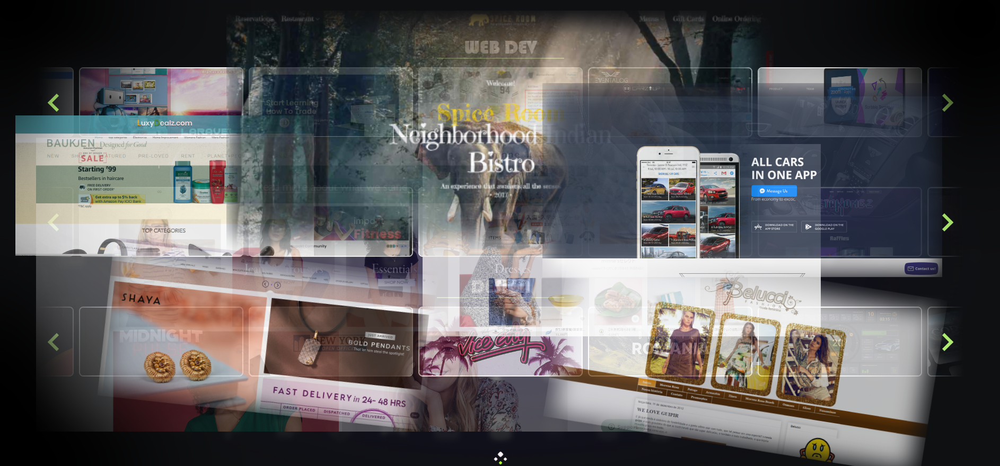

 

  

<h1 align="center">
        Thanks for visiting my Github profile. 
</h1>

  

 

<h3 align="center"> Skills</h3>

 
  <table>
    <tr>
      <td valign="center" width="100px"><b>Frontend<b></td>
      <td valign="center" width="100px"><b>Backend<b></td>
      <td valign="center" width="100px"><b>Mobile<b></td>
    </tr>
    <tr>
      <td valign="center" align="center" width="300px">
         
         
        
         
         
         
         
         
        
        
      </td>      
      <td valign="center" align="center" width="300px">
         
         
         
         
         
         
         
         
              
         
      </td>
      <td valign="center" align="center" width="300px">
         
         
         
         
         
        
      </td>
    </tr>
  </table>
  
 <table>
    <tr>
      <td valign="center" width="100px"><b>Blockchain<b></td>
      <td valign="center" width="100px"><b>Design<b></td>
    </tr>
    <tr>
      <td valign="center" align="center" width="300px">
         
         
         
         
         
         
         
        
      </td>
     <td valign="center" align="center" width="300px">
        
        
        
        
        
        
      </td>
    </tr>
  </table>

  

    

  

 

  

 

   

  

  
  &nbsp;&nbsp;
  
  &nbsp;&nbsp;
  
  &nbsp;&nbsp;
  
  

<h2 align="center"> Thanks for visiting my profile. </h2>

  

